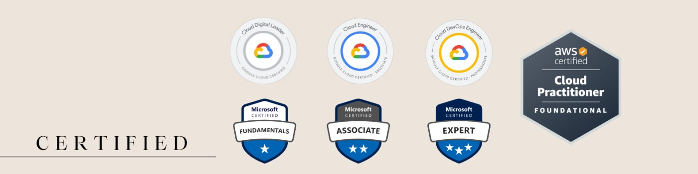

# Hey Everyone 👋, I'm Sudheer

A passionate DevOps Engineer from India.  
I work in the Corporate IT sector and in my free time I create DevOps content.

## 🌐 Connect with me
  

## 🛠️ Tech Stack

## 📊 GitHub Stats

<!--
**Sudheerkodati45/Sudheerkodati45** is a ✨ _special_ ✨ repository because its `README.md` (this file) appears on your GitHub profile.

Here are some ideas to get you started:

- 🔭 I’m currently working on ...
- 🌱 I’m currently learning ...
- 👯 I’m looking to collaborate on ...
- 🤔 I’m looking for help with ...
- 💬 Ask me about ...
- 📫 How to reach me: ...
- 😄 Pronouns: ...
- ⚡ Fun fact: ...
-->
