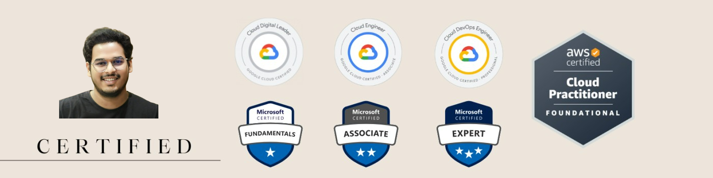

<h1 style="text-align: center;">
             Hey Everyone 👋, I'm Sudheer Kodati
</h1>

## 🚀 About Me

I am a passionate DevOps Engineer with hands-on experience in designing, automating, and managing cloud-native infrastructure and CI/CD workflows. I work closely with enterprise-scale systems, building reliable and scalable Kubernetes-based platforms and cloud solutions.

Currently, I work with **SIDGS Digisol Pvt Ltd for ICICI Bank (Client)**, where I focus on automating deployments, managing hybrid cloud environments, and ensuring high availability of production systems using modern DevOps practices.

I am continuously learning and building in the DevOps and Cloud space, with a strong focus on automation, scalability, and reliability.

## 📌 Profile & Contact

- 👨‍💻 All of my projects are available at:  
  https://github.com/Sudheerkodati45 
- 💬 Ask me about **DevOps & Cloud DevOps**
- 📧 How to reach me: **kodatisudheer5@gmail.com**
  

## 🌐 Connect with me
  

## 🛠️ Languages and Tools:

  

## 🏅 Certifications

## 📊 GitHub Stats

<!--
**Sudheerkodati45/Sudheerkodati45** is a ✨ _special_ ✨ repository because its `README.md` (this file) appears on your GitHub profile.

Here are some ideas to get you started:

- 🔭 I’m currently working on ...
- 🌱 I’m currently learning ...
- 👯 I’m looking to collaborate on ...
- 🤔 I’m looking for help with ...
- 💬 Ask me about ...
- 📫 How to reach me: ...
- 😄 Pronouns: ...
- ⚡ Fun fact: ...
-->
